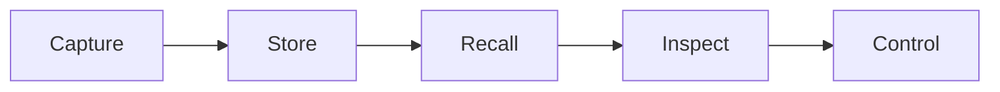
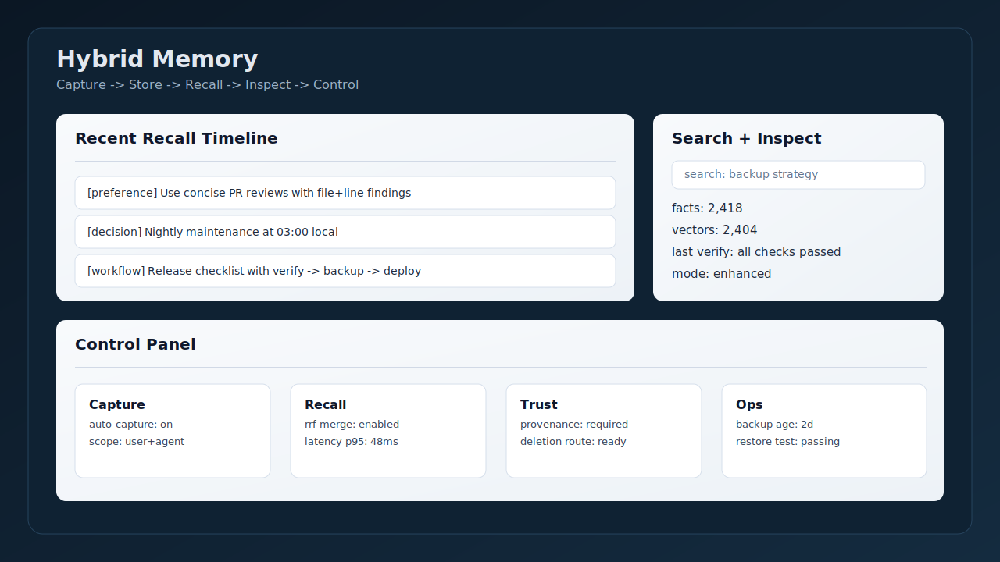

<div align="center">

# OpenClaw Hybrid Memory

**Local-first memory for OpenClaw that stays inspectable, trustworthy, and useful over time.**

[](https://github.com/markus-lassfolk/openclaw-hybrid-memory/actions/workflows/ci.yml)
[](https://markus-lassfolk.github.io/openclaw-hybrid-memory/)
[](LICENSE)
[](https://nodejs.org)
[](https://github.com/openclaw/openclaw)

</div>

## Mental model first



Hybrid Memory keeps durable context in your control:
- `Capture`: facts, preferences, decisions, and recurring workflows from your usage
- `Store`: local SQLite + vector index with provenance metadata
- `Recall`: automatic and CLI-assisted retrieval when context is relevant
- `Inspect`: stats, search, verification, and dashboard views
- `Control`: explicit config modes, export, backup, and delete paths



## What users ask first

| Question | Answer |
|---|---|
| **What gets remembered?** | Facts, preferences, procedures, issues, workflows, and derived insights (depending on enabled features). |
| **Where is it stored?** | On your machine by default: SQLite + LanceDB files under your OpenClaw data paths. |
| **How do I inspect it?** | `openclaw hybrid-mem verify`, `stats`, `search`, `export`, dashboard routes, and docs-linked SQL tools. |
| **How do I delete it?** | Use CLI uninstall/cleanup paths and documented deletion + backup/restore procedures. |

Trust and deletion details: [docs/trust-and-privacy.md](docs/trust-and-privacy.md)

## 3 ways to start

### 1. Quick local install (personal assistant)
Best for first-time setup and local-first defaults.

```bash
openclaw plugins install openclaw-hybrid-memory
openclaw hybrid-mem install
openclaw gateway stop && openclaw gateway start
openclaw hybrid-mem verify
```

Guide: [docs/QUICKSTART.md](docs/QUICKSTART.md)

### 2. Trusted production install (serious operator)
Best for stable upgrades, repeatable verification, backup/restore, and operations playbooks.

```bash
openclaw hybrid-mem verify --fix
openclaw hybrid-mem stats
openclaw hybrid-mem backup --dest ./backup
```

Guide: [docs/OPERATIONS.md](docs/OPERATIONS.md)

### 3. Multi-agent / advanced mode (research or governance-heavy teams)
Best for scoped memory, graph retrieval, workflows, crystallization, and higher automation.

```bash
openclaw hybrid-mem config-mode complete
openclaw gateway restart
openclaw hybrid-mem verify
openclaw hybrid-mem search "your query"
```

Guide: [docs/advanced-capabilities.md](docs/advanced-capabilities.md)

## Comparison at a glance

| Capability | Session-only memory | Generic vector memory | **Hybrid Memory** |
|---|---:|---:|---:|
| Persists across sessions | No | Yes | Yes |
| Structured + semantic retrieval | No | Usually semantic-only | Yes (merged ranking) |
| Inspectability (stats/verify/provenance) | Low | Medium | High |
| Explicit trust/deletion controls | Low | Varies | High |
| Local-first operation | N/A | Sometimes | Yes |
| Multi-agent scope controls | No | Limited | Yes |

## Fast path docs

- [docs/QUICKSTART.md](docs/QUICKSTART.md): shortest successful path
- [docs/trust-and-privacy.md](docs/trust-and-privacy.md): local-first, provenance, deletion, export
- [docs/OPERATIONS.md](docs/OPERATIONS.md): maintenance, backup, restore, troubleshooting
- [docs/advanced-capabilities.md](docs/advanced-capabilities.md): graph, workflows, procedures, crystallization

## Common commands

```bash
openclaw hybrid-mem verify
openclaw hybrid-mem stats
openclaw hybrid-mem search "..."
openclaw hybrid-mem export --help
openclaw hybrid-mem uninstall
```

## Deep references (cathedral)

- [docs/HOW-IT-WORKS.md](docs/HOW-IT-WORKS.md)
- [docs/FEATURES.md](docs/FEATURES.md)
- [docs/ARCHITECTURE.md](docs/ARCHITECTURE.md)
- [docs/CLI-REFERENCE.md](docs/CLI-REFERENCE.md)
- [docs/OPERATIONS.md](docs/OPERATIONS.md)
- [docs/SCENARIOS.md](docs/SCENARIOS.md)

## For developers

Plugin source and manifest: [extensions/memory-hybrid/README.md](extensions/memory-hybrid/README.md)

## License

MIT ([LICENSE](LICENSE))

