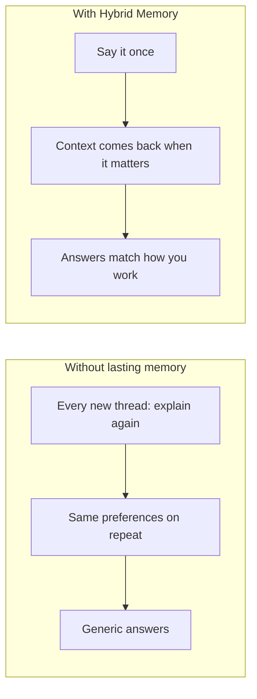
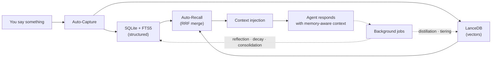

<div align="center">

# OpenClaw Hybrid Memory

**An AI assistant that remembers you — across sessions, projects, and weeks of use.**

[](https://github.com/markus-lassfolk/openclaw-hybrid-memory/actions/workflows/ci.yml)
[](https://markus-lassfolk.github.io/openclaw-hybrid-memory/)
[](LICENSE)
[](https://github.com/markus-lassfolk/openclaw-hybrid-memory/stargazers)
[](https://nodejs.org)
[](https://github.com/openclaw/openclaw)

[**Documentation**](https://markus-lassfolk.github.io/openclaw-hybrid-memory/) · [GitHub](https://github.com/markus-lassfolk/openclaw-hybrid-memory)

</div>

---

> You told your AI something important last week — a preference, a decision, a name. Now it is gone. You are starting from zero. Again.

**Hybrid Memory** is an [OpenClaw](https://github.com/openclaw/openclaw) extension that ends that loop: **durable memory** that captures what matters, recalls it when relevant, and stays organized over time. Under the hood it combines **structured storage** and **semantic search** (details in [How it works](docs/HOW-IT-WORKS.md)).

---

## See the difference



**Story-style examples** (meetings, long projects, fuzzy recall): [Scenarios & benefits](docs/SCENARIOS.md).

---

## What you get (in plain language)

| You want… | Hybrid Memory helps by… |
|-----------|-------------------------|
| Stop repeating yourself | Remembering preferences, decisions, and facts you have already stated |
| Less copy-paste from old chats | Surfacing relevant past context automatically when configured |
| “I know we discussed this…” | Finding ideas by meaning, not only exact wording |
| Memory that does not rot | Tiering, decay, and scheduled maintenance so storage stays useful |
| Control and privacy options | Profiles from **fully local** to **full cloud** — see modes below |

---

## Get running in about a minute

```bash
# 1. Install the plugin
openclaw plugins install openclaw-hybrid-memory

# 2. Apply recommended defaults (plugin slot, prompts, limits)
openclaw hybrid-mem install
#    If maintenance cron jobs are missing: openclaw hybrid-mem verify --fix (up to 8 jobs — see CLI reference)

# 3. Configure embeddings in ~/.openclaw/openclaw.json
#    https://markus-lassfolk.github.io/openclaw-hybrid-memory/docs/LLM-AND-PROVIDERS.html

# 4. Restart and verify
openclaw gateway stop && openclaw gateway start
openclaw hybrid-mem verify
```

When everything is healthy, `verify` ends with **`All checks passed.`** and uses **`✅`** (or `[OK]` with `--no-emoji`) on lines such as SQLite, LanceDB, and embedding checks — plus a **scheduled jobs** section. Paths and counts depend on your machine.

**That is it** — your agent can remember you across sessions. Full walkthrough: [Quick start](docs/QUICKSTART.md).

---

## Under the hood (technical)



Every turn (when enabled), relevant memories can be fetched and merged into context. Background jobs keep the store healthy. Full narrative: [How it works](docs/HOW-IT-WORKS.md).

---

## Features at a glance

| Feature | What it does for you |
|---------|----------------------|
| **Auto-Capture** | Pulls durable facts and preferences from conversation when configured |
| **Auto-Recall** | Brings relevant memories into context without you re-pasting |
| **Dual search** | Fast structured lookup **plus** semantic “fuzzy” recall (merged for ranking) |
| **Memory tiering** | Keeps hot context small while older material stays reachable |
| **Multi-agent scoping** | Global / user / agent / session — share what specialists should share |
| **Background reflection** | Summarizes patterns from accumulated facts (when enabled) |
| **Skill crystallization** | Proposes recurring workflows as skills — you approve before write |
| **Credential vault** | Optional encrypted storage; can help on auth failures |
| **Crash-resilient writes** | WAL-style durability for memory operations |
| **TTL decay** | Old facts can expire so memory stays fresh |

More detail: [Features](docs/FEATURES.md) · [Graph / contacts](docs/GRAPH-MEMORY.md) · [Multilingual NER](docs/MULTILINGUAL-SUPPORT.md)

---

## Why Hybrid Memory?

*Rough positioning — products differ by version and config; validate against anything you deploy in production.*

| | Plain context window | Vectors only | Typical hosted memory API | **Hybrid Memory** |
|---|:---:|:---:|:---:|:---:|
| Persists across sessions | ✗ | ✓ | ✓ | ✓ |
| Structured + semantic recall | ✗ | Usually semantic-first | Often semantic-first | **Both** (merged ranking) |
| Background reflection / consolidation | ✗ | ✗ | Varies | ✓ (when enabled) |
| Decay & tiering | ✗ | ✗ | Varies | ✓ |
| Fully **local** profile | n/a | Sometimes | Rare | ✓ (`local` mode) |
| Multi-agent scoping | ✗ | ✗ | Limited | ✓ |
| Less manual context paste | ✗ | Partial | Partial | **Strong** (auto-recall + search) |

---

## Choose how you run it

```bash
openclaw hybrid-mem config-mode <mode>
```

| Mode | Best for | Cost | In short |
|------|-----------|------|----------|
| **local** | Privacy-first, air-gapped | **$0** (local embeddings) | Important data stays on your machine |
| **minimal** | Light cloud, fewer background jobs | Very low | Lean automation |
| **enhanced** | Daily driver | Low | Strong balance of quality and cost |
| **complete** | Power users, experiments | Medium | Advanced automation and quality features |

Details: [Configuration modes](docs/CONFIGURATION-MODES.md)

---

## See it in the wild

The **[OpenClaw Personal Assistant Ecosystem](https://github.com/markus-lassfolk/openclaw-personal-assistant)** uses this plugin for a proactive assistant that learns your priorities over time.

---

## Common commands

```bash
openclaw hybrid-mem verify          # health (use --fix to patch config / jobs)
openclaw hybrid-mem stats           # quick store overview
openclaw hybrid-mem search "…"      # search your memory
openclaw hybrid-mem reflect         # reflection cycle (if enabled)
openclaw hybrid-mem uninstall       # clean removal
```

[CLI reference](docs/CLI-REFERENCE.md)

---

## Prerequisites

- **OpenClaw** v2026.3.8+
- **Node.js** ≥ 22.12.0
- **Embedding provider** (required for the plugin to load)
- **Chat / LLM access** optional for basic storage; needed for reflection, distillation, auto-classify, etc.

[LLM and providers](docs/LLM-AND-PROVIDERS.md)

---

## Documentation

### Start here

| Guide | Description |
|-------|-------------|
| [Quick start](docs/QUICKSTART.md) | Install, configure, verify |
| [How it works](docs/HOW-IT-WORKS.md) | Capture, recall, background jobs, costs |
| [Scenarios & benefits](docs/SCENARIOS.md) | Narrative before/after |
| [Examples](docs/EXAMPLES.md) | Recipes: tuning, backfill, maintenance |
| [FAQ](docs/FAQ.md) | Cost, backups, troubleshooting |

### Reference

| Doc | Description |
|-----|-------------|
| [Configuration](docs/CONFIGURATION.md) | Full `openclaw.json` reference |
| [Architecture](docs/ARCHITECTURE.md) | Layout, bootstrap, subsystems |
| [CLI reference](docs/CLI-REFERENCE.md) | All `hybrid-mem` commands |
| [Memory protocol](docs/MEMORY-PROTOCOL.md) | Paste-ready `AGENTS.md` block |

### Operations

| Doc | Description |
|-----|-------------|
| [Operations](docs/OPERATIONS.md) | Cron, jobs, upgrades |
| [Troubleshooting](docs/TROUBLESHOOTING.md) | Diagnostics, gateway quirks |
| [Backup](docs/BACKUP.md) | What to back up |
| [Uninstall](docs/UNINSTALL.md) | Clean removal |

<details>
<summary><strong>Deep dives</strong></summary>

| Topic | Doc |
|-------|-----|
| Memory tiering | [MEMORY-TIERING.md](docs/MEMORY-TIERING.md) |
| Multi-agent scoping | [MEMORY-SCOPING.md](docs/MEMORY-SCOPING.md) |
| Graph memory | [GRAPH-MEMORY.md](docs/GRAPH-MEMORY.md) |
| Session distillation | [SESSION-DISTILLATION.md](docs/SESSION-DISTILLATION.md) |
| Procedural memory | [PROCEDURAL-MEMORY.md](docs/PROCEDURAL-MEMORY.md) |
| Reflection | [REFLECTION.md](docs/REFLECTION.md) |
| Credential vault | [CREDENTIALS.md](docs/CREDENTIALS.md) |
| WAL / crash resilience | [WAL-CRASH-RESILIENCE.md](docs/WAL-CRASH-RESILIENCE.md) |
| Decay & pruning | [DECAY-AND-PRUNING.md](docs/DECAY-AND-PRUNING.md) |
| Persona proposals | [PERSONA-PROPOSALS.md](docs/PERSONA-PROPOSALS.md) |

</details>

**Searchable site:** [Documentation home](https://markus-lassfolk.github.io/openclaw-hybrid-memory/)

---

## For developers

Plugin source and manifest: [`extensions/memory-hybrid/README.md`](extensions/memory-hybrid/README.md).

---

## Contributing

Issues and pull requests are welcome.

---

## Credits & license

Attribution and a detailed “what this repo adds” list: **[Credits & attribution](docs/CREDITS-AND-ATTRIBUTION.md)**.

Licensed under the [MIT License](LICENSE).
