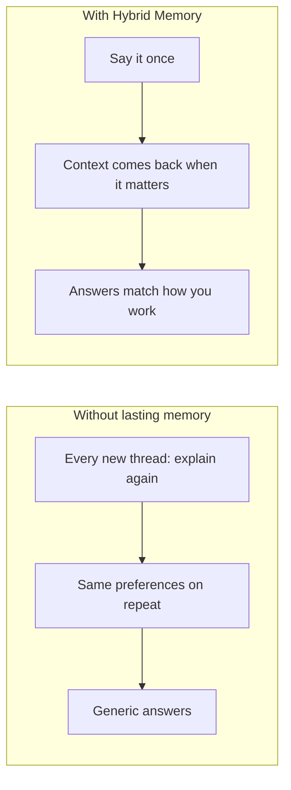

# OpenClaw Hybrid Memory

**An AI assistant that remembers you — across sessions, projects, and weeks of use.**

[](https://github.com/markus-lassfolk/openclaw-hybrid-memory/actions/workflows/ci.yml)
[](https://markus-lassfolk.github.io/openclaw-hybrid-memory/)
[](LICENSE)

[Documentation site](https://markus-lassfolk.github.io/openclaw-hybrid-memory/) · [GitHub](https://github.com/markus-lassfolk/openclaw-hybrid-memory)

---

## The problem

You have probably been here before: you told your assistant something important — a preference, a decision, who owns what — and the next day or the next chat, **it is gone**. You start from zero again.

**Hybrid Memory** is an [OpenClaw](https://github.com/openclaw/openclaw) extension that gives your agent **durable memory**: it can **capture** what matters, **recall** it when relevant, and **stay organized** over time (with configurable cleanup and depth).

---

## See the difference



**Story-style examples** (meetings, long projects, fuzzy recall): [Scenarios & benefits](docs/SCENARIOS.md) on the docs site.

---

## What you get (in plain language)

| You want… | Hybrid Memory helps by… |
|-----------|-------------------------|
| Stop repeating yourself | Remembering preferences, decisions, and facts you have already stated |
| Less copy-paste from old chats | Surfacing relevant past context automatically when configured |
| “I know we discussed this…” | Finding ideas by meaning, not only exact wording |
| Memory that does not rot | Tiering, decay, and scheduled maintenance so storage stays useful |
| Control and privacy options | Profiles from **fully local** to **full cloud** — see modes below |

Technical architecture (stores, retrieval, cron jobs) lives in the docs: start with [How it works](docs/HOW-IT-WORKS.md) and [Architecture](docs/ARCHITECTURE.md).

---

## Get started (about one minute)

```bash
openclaw plugins install openclaw-hybrid-memory
openclaw hybrid-mem install
# Set embedding provider in ~/.openclaw/openclaw.json — see docs below
openclaw gateway stop && openclaw gateway start
openclaw hybrid-mem verify
```

**Step-by-step:** [Quick start](docs/QUICKSTART.md) · **Providers & API keys:** [LLM and providers](docs/LLM-AND-PROVIDERS.md)

---

## Choose how you run it

```bash
openclaw hybrid-mem config-mode <mode>
```

| Mode | Best for | Cost | In short |
|------|-----------|------|----------|
| **local** | Privacy-first, air-gapped | **$0** (no cloud embeddings required) | Everything important stays on your machine |
| **minimal** | Light cloud use, fewer background jobs | Very low | Lean cloud setup without heavy automation |
| **enhanced** | Daily driver | Low | Strong balance of recall quality and efficiency |
| **complete** | Power users and experiments | Medium | Enables advanced automation and quality features |

Details: [Configuration modes](docs/CONFIGURATION-MODES.md)

---

## See it in the wild

The **[OpenClaw Personal Assistant Ecosystem](https://github.com/markus-lassfolk/openclaw-personal-assistant)** uses this plugin for a proactive assistant that learns your priorities over time.

---

## Documentation (one place to dig deeper)

| Start here | Then |
|------------|------|
| [Quick start](docs/QUICKSTART.md) | [FAQ](docs/FAQ.md) · [Examples](docs/EXAMPLES.md) |
| [How it works](docs/HOW-IT-WORKS.md) | [Configuration](docs/CONFIGURATION.md) · [CLI reference](docs/CLI-REFERENCE.md) |
| [Scenarios & benefits](docs/SCENARIOS.md) | [Features](docs/FEATURES.md) · [Troubleshooting](docs/TROUBLESHOOTING.md) |

**Full table of contents:** [Documentation home](https://markus-lassfolk.github.io/openclaw-hybrid-memory/) (searchable site).

---

## Prerequisites

- **OpenClaw** v2026.3.8+
- **Node.js** ≥ 22.12.0
- **Embedding provider** (required for the plugin to load) — local or cloud; see [LLM and providers](docs/LLM-AND-PROVIDERS.md)

---

## Common commands

```bash
openclaw hybrid-mem verify          # health check (use --fix to patch config)
openclaw hybrid-mem stats           # quick store overview
openclaw hybrid-mem search "…"      # search your memory
openclaw hybrid-mem reflect         # run a reflection cycle (if enabled)
openclaw hybrid-mem uninstall       # clean removal
```

---

## For developers

Plugin source, manifest, and implementation notes: [`extensions/memory-hybrid/README.md`](extensions/memory-hybrid/README.md).

---

## Credits

Hybrid Memory stands on great prior work. Full attribution and a detailed list of what this repository adds: **[Credits & attribution](docs/CREDITS-AND-ATTRIBUTION.md)**.
