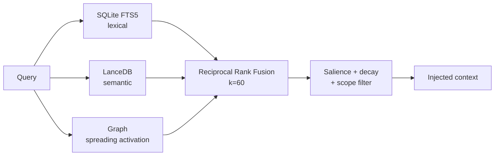

<div align="center">

# OpenClaw Hybrid Memory

**Your agent forgets everything when the session ends. This fixes that — on your own machine.**

[](https://github.com/markus-lassfolk/openclaw-hybrid-memory/actions/workflows/ci.yml)
[](https://www.npmjs.com/package/openclaw-hybrid-memory)
[](https://markus-lassfolk.github.io/openclaw-hybrid-memory/)
[](LICENSE)
[](https://nodejs.org)
[](https://github.com/openclaw/openclaw)

[Install](#install-in-2-minutes) · [What you get](#what-actually-changes) · [Cost & privacy](#will-this-cost-me-money-or-leak-my-data) · [Docs](https://markus-lassfolk.github.io/openclaw-hybrid-memory/)

</div>

---

## The problem

Every new session, your agent starts from zero. You re-explain your stack, your preferences, the decision you made last Tuesday and why. The context window is not memory — it evaporates.

**Before:**

```
You:  Set up the deploy script for the staging box.
Agent: Sure! Which platform are you deploying to? What's your
       preferred package manager? Do you use Docker?
You:  ...we did this last week.
```

**After:**

```
You:  Set up the deploy script for the staging box.
Agent: Using your usual setup — pnpm, Node 22, the Hetzner staging
       host at staging.internal, deploy via rsync + systemd reload
       (you moved off Docker in March because of the ARM build times).
       Here's the script:
```

Nothing was pasted into that second prompt. The agent recalled it, because it captured it the first time.

---

## Install in 2 minutes

```bash
openclaw plugins install openclaw-hybrid-memory
openclaw hybrid-mem install          # merges recommended config, creates workspace files
openclaw gateway stop && openclaw gateway start
openclaw hybrid-mem verify           # confirms DB, embeddings, hooks, and tools are live
```

`hybrid-mem install` pre-fills the safest embedding setup it can detect and preserves any existing API key. Full walkthrough: **[docs/QUICKSTART.md](docs/QUICKSTART.md)**.

**Requirements:** OpenClaw ≥2026.5.0 (≥2026.6.1 recommended) · Node ≥22.16.0 · an embedding provider — which can be fully local ([see below](#will-this-cost-me-money-or-leak-my-data)).

---

## What actually changes

Two things start happening immediately, with no configuration:

| | |
|---|---|
| **Capture** | At session end, durable facts are extracted from the transcript — preferences, decisions, procedures, constraints — and written to local storage with provenance. Duplicates are folded in; contradictions are flagged rather than silently stacked. |
| **Recall** | At session start (and on relevant turns), the memories that matter for *this* conversation are retrieved and injected into context. |

A third capability is deliberately **opt-in**, because it costs tokens:

| | |
|---|---|
| **Curate** | A nightly cycle that prunes, decays, consolidates episodes, and reflects on patterns — so memory gets *better* over time instead of becoming a junk drawer. Off in every preset; enable `nightlyCycle` when you want it. Targets ~$0.003/night on a flash-tier model. |

Your agent also gets memory tools it can call directly, and you get **187 CLI commands** to inspect and control all of it.

<details>
<summary><b>The three tools you'll actually notice — and why the other 114 don't bloat your context</b></summary>

```bash
# The agent calls these itself; you can too.
memory_store    # "Save important information in long-term memory."
memory_recall   # "Search long-term memories using both structured (exact) and semantic (fuzzy) search."
memory_forget   # Remove it. Really remove it.
```

There are **117 tools in the full contract**, covering graph traversal, beliefs and evidence, episodes, procedures, goals, issues, credentials, and the approval queues — but registration is **gated on config**. The graph tools only exist if `graph.enabled`, credential tools only if the vault is on, Loom tools only if `loom.enabled`, and so on. In `local` mode you get the small core, not the full 117.

You don't need to learn any of them to benefit from the plugin. See [docs/FEATURES.md](docs/FEATURES.md) when you're curious.

</details>

---

## See it: the Memory Graph

Memory you cannot inspect is memory you cannot trust. Hybrid Memory ships a live, interactive constellation of everything it knows at **`http://127.0.0.1:7700/graph`** — strongest memories in the center, pulses as memories are recalled in real time, topic clustering, and in-place curation (add / edit / remove / link, plus gap and contradiction views).


The same local server hosts **Mission Control** (`http://127.0.0.1:7700`) for stats, health, and the review queues. Both bind to loopback only — `127.0.0.1`, never `0.0.0.0`.

→ [docs/MEMORY-GRAPH-APP.md](docs/MEMORY-GRAPH-APP.md)

---

## Will this cost me money or leak my data?

The two questions everyone asks, answered honestly.

**It can run with zero cloud calls and zero cost.** Set `mode: "local"` and use a local embedding provider:

```jsonc
{
  "mode": "local",                              // FTS-only recall, no external LLM calls
  "embedding": { "provider": "ollama",          // or "onnx" — both fully local, no API key
                 "model": "nomic-embed-text" }
}
```

In `local` mode the retrieval path never builds a query vector and never calls an LLM — it's SQLite full-text search over files on your disk. Good enough to run on a Raspberry Pi.

**One honest caveat:** the plugin *requires* a valid embedding provider to load. It can be a local one (Ollama or ONNX, no API key), but "no embedding provider at all" is not a supported configuration. It will tell you clearly at startup rather than failing silently.

**If you do enable the LLM features**, they're built to be cheap: the nightly dream cycle targets **~$0.003/night** on a flash-tier model, and `minimal` mode restricts every LLM call to nano/flash tiers. See [docs/COST-OPTIMIZATION-PLAYBOOK.md](docs/COST-OPTIMIZATION-PLAYBOOK.md).

**On privacy:** storage is SQLite + LanceDB files under your OpenClaw data paths. Nothing is sent anywhere you didn't configure. Every memory carries provenance, and there are explicit paths to export, back up, and delete — including full uninstall. Details and the deletion procedure: [docs/trust-and-privacy.md](docs/trust-and-privacy.md).

---

## Pick your level

You don't have to adopt all of this at once. Set one config key:

| Mode | What it does | Cost |
|---|---|---|
| **`local`** *(default)* | Auto-capture + auto-recall, FTS-only. No external LLM. Offline-friendly. | $0 |
| **`minimal`** | Adds auto-classification, graph links, procedures, session distillation — all pinned to nano/flash models. | ~cents/month |
| **`enhanced`** | Adds entity lookup on recall, reflection, self-correction, classify-before-write. | low |
| **`complete`** | Same toggles as enhanced, plus verbose logging. Advanced modules stay opt-in by design. | low |

```bash
openclaw hybrid-mem config-mode minimal && openclaw gateway restart
```

The expensive modules — dream cycle, crystallization, workflow tracking, document ingest, query expansion — stay **off in every preset**, including `complete`. Presets never silently opt you into token spend. → [docs/CONFIGURATION-MODES.md](docs/CONFIGURATION-MODES.md)

---

## How retrieval actually works

This is the part that makes it "hybrid" rather than "a vector store with extra steps."


```mermaid
flowchart LR
  Q[Query] --> F[SQLite FTS5<br/>lexical]
  Q --> V[LanceDB<br/>semantic]
  Q --> G[Graph<br/>spreading activation]
  F --> R[Reciprocal Rank Fusion<br/>k=60]
  V --> R
  G --> R
  R --> S[Salience + decay<br/>+ scope filter]
  S --> C[Injected context]
```

Each strategy ranks candidates independently, then **Reciprocal Rank Fusion** (`score = Σ 1/(k + rank)`, k=60) merges them — so a fact that ranks well in *both* lexical and semantic search beats one that merely spikes in either. Results are then re-scored by dynamic salience and decay, filtered by scope, and hydrated.

A pure vector store can't find the exact error string you pasted. Pure keyword search can't find "the thing about deployment" when you wrote "shipping process." Fusing them is why this works.

→ [docs/HOW-IT-WORKS.md](docs/HOW-IT-WORKS.md) · [docs/ARCHITECTURE.md](docs/ARCHITECTURE.md)

---

## Beyond storage: keeping memory useful at month six

Storing facts is the easy part. Keeping a memory store *useful* after six months is the hard part. These are the modules that do it:

| Module | What it solves | Default |
|---|---|---|
| **The Loom** | An agent-native belief graph: claims backed by evidence capsules, open-loop obligations, drift detection, and live-check requirements for facts that go stale. | **On** (set `loom.enabled: false` to opt out) |
| **Decay & tiering** | Memories cool hot → warm → cold instead of every fact competing forever. | On in `minimal`+ |
| **Credential vault** | Secrets with full revision history, pinning, and restore. Set `credentials.encryptionKey` for encryption at rest. | On |
| **Nightly dream cycle** | Prune, decay, consolidate episodes, reflect on patterns, refresh the index, optimize FTS. Self-contained — needs no active session. | Off — opt in |
| **Crystallization** | Repeated workflows get proposed as reusable `SKILL.md` files — your agent writes its own skills. | Off — opt in |
| **Multi-agent scoping** | Separate memory scopes per agent, with dynamic agent detection. Cross-agent scope params are **not** trusted unless you say so. | Secure by default |

**Approval gates everywhere.** Persona proposals, tool proposals, crystallized skills, and procedure promotions all land in a review queue. The agent proposes; you decide. Nothing self-modifies behind your back.

→ [docs/advanced-capabilities.md](docs/advanced-capabilities.md) · [docs/AUTONOMOUS-DREAMING.md](docs/AUTONOMOUS-DREAMING.md) · [docs/CREDENTIALS.md](docs/CREDENTIALS.md)

---

## How it compares

| | Session-only context | Naive vector store | Hosted memory SaaS | **Hybrid Memory** |
|---|---|---|---|---|
| Survives session end | ✗ | ✓ | ✓ | ✓ |
| Runs fully offline | n/a | sometimes | ✗ | ✓ (`local` mode) |
| Lexical **and** semantic retrieval | ✗ | semantic only | varies | ✓ RRF-fused |
| Self-maintaining (decay, dedup, consolidation) | n/a | ✗ | varies | ✓ dedup + decay on; consolidation opt-in |
| Inspect every stored fact + its provenance | ✗ | limited | limited | ✓ CLI + graph UI |
| Your data on your disk | ✓ | ✓ | ✗ | ✓ |
| Delete it for real | n/a | ✓ | provider-dependent | ✓ documented |

---

## Everyday commands

```bash
openclaw hybrid-mem verify            # health check (add --fix to repair)
openclaw hybrid-mem stats             # what's in there
openclaw hybrid-mem search "docker"   # query it directly
openclaw hybrid-mem dashboard         # open Mission Control
openclaw hybrid-mem backup --dest ./backup
openclaw hybrid-mem export --help     # take your data with you
openclaw hybrid-mem uninstall         # clean removal
```

Full list (187 commands): [docs/CLI-REFERENCE.md](docs/CLI-REFERENCE.md) · [docs/COMMON-TASKS-CHEATSHEET.md](docs/COMMON-TASKS-CHEATSHEET.md)

---

## Under the hood

Because "is this a weekend project?" is a fair question:

| | |
|---|---|
| Source | ~250k lines of strict TypeScript (excluding tests), ESM |
| Tests | 10,000+ tests across ~790 files, run on Node 22 **and** 24 in CI |
| Storage | SQLite (`node:sqlite`, WAL, FTS5) across 70+ tables + LanceDB vectors |
| Surface | 117 agent tools · 187 CLI commands · GraphQL + SSE for the graph app |
| Gates | typecheck, Biome lint + format, maintenance gate, schema gate, dead-code analysis, publish-invariant checks, CodeQL |
| Release | CalVer, automated tag → GitHub Release → npm publish on green CI |

---

## Documentation

**Start here**
- [Quick Start](docs/QUICKSTART.md) — shortest path to a working setup
- [Configuration Modes](docs/CONFIGURATION-MODES.md) — pick your level
- [Trust & Privacy](docs/trust-and-privacy.md) — storage, provenance, export, deletion
- [FAQ](docs/FAQ.md) · [Troubleshooting](docs/TROUBLESHOOTING.md)

**Going deeper**
- [How It Works](docs/HOW-IT-WORKS.md) · [Architecture](docs/ARCHITECTURE.md) · [Features](docs/FEATURES.md)
- [Memory Graph App](docs/MEMORY-GRAPH-APP.md) · [Advanced Capabilities](docs/advanced-capabilities.md)
- [LLM & Providers](docs/LLM-AND-PROVIDERS.md) · [Cost Optimization](docs/COST-OPTIMIZATION-PLAYBOOK.md)

**Running it seriously**
- [Operations](docs/OPERATIONS.md) · [Maintenance](docs/MAINTENANCE.md) · [Backup](docs/BACKUP.md)
- [Operator Architecture Map](docs/OPERATOR-ARCHITECTURE-MAP.md) · [Credentials Vault](docs/CREDENTIALS.md)

Full documentation site: **[markus-lassfolk.github.io/openclaw-hybrid-memory](https://markus-lassfolk.github.io/openclaw-hybrid-memory/)**

---

## Project status & contributing

Actively developed, released on a CalVer cadence — see [CHANGELOG.md](CHANGELOG.md) and the [roadmap](docs/PRODUCTISATION-TRACK.md) for what's shipped and what's next.

Issues and PRs welcome. [CONTRIBUTING.md](CONTRIBUTING.md) covers setup, the quality gates, and good first issues. The required checks before opening a PR:

```bash
cd extensions/memory-hybrid
npx tsc --noEmit && npm run lint && npm test
```

Plugin source and manifest live in [`extensions/memory-hybrid/`](extensions/memory-hybrid/README.md).

## License

MIT — [LICENSE](LICENSE)
