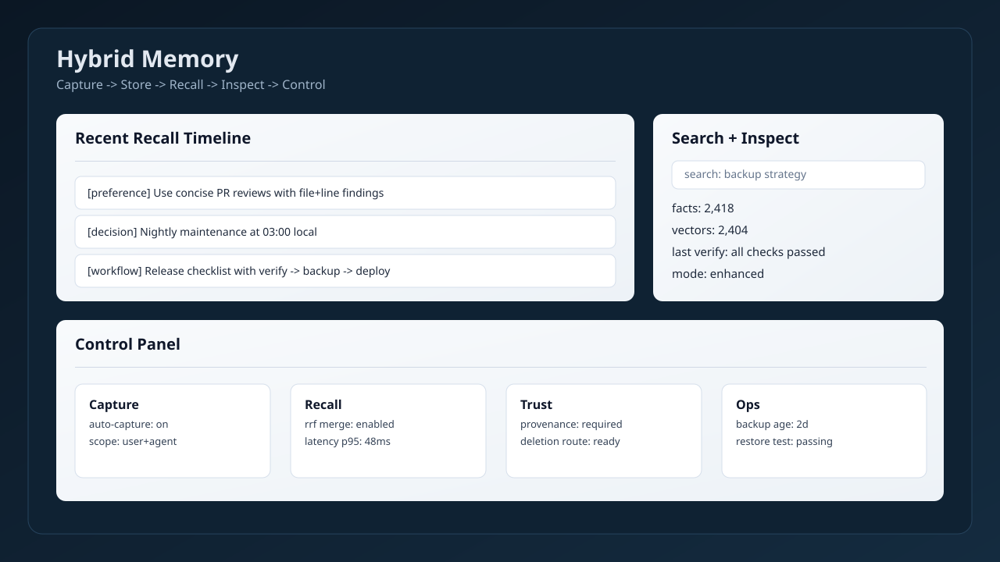

# Memory Graph — a living constellation

An interactive, real-time visualization of your hybrid memory: every fact is a star, every typed
link a bond. The strongest memories gravitate to the center, communities cluster together, and — as
your OpenClaw agent works — you watch memories being stored, linked, and recalled **live**. From the
same view you can inspect, edit, add, remove, pin, and re-bond memories, and surface the graph's
gaps and anomalies (orphans, contradictions, weak/suspicious links, stale-but-important facts).



---

## Opening it

The app is served by the plugin's Mission Control dashboard server (no extra process):

```bash
openclaw hybrid-mem dashboard   # prints the dashboard URL, e.g. http://127.0.0.1:7700
```

Then open **`http://127.0.0.1:7700/graph`** in a browser. The dashboard server starts automatically
with the gateway when `dashboard.enabled` is `true` (the default). It binds to `127.0.0.1` only.

If you see a "*Memory Graph app not built*" placeholder, build the SPA once (it ships pre-built in
the published npm package, so this is only needed for local source checkouts):

```bash
cd extensions/memory-hybrid/graph-app && npm ci && npm run build
# or, from the plugin root: npm run build:graph-app
```

---

## What you can do

### See the shape of the mind
- **Strongest in the center.** Each node's radial position and size come from a composite *strength*
  score (importance × recency × confidence, plus pin and recall-frequency boosts — the same
  `computeNodeStrength` the retrieval engine's composite score is built from). Central = load-bearing.
- **Typed, colored bonds.** `RELATED_TO`, `CAUSED_BY`, `PART_OF`, `DEPENDS_ON`, `SUPERSEDES`,
  `INSTANCE_OF`, `CONTRADICTS` each have a distinct color; edge width tracks strength.
- **Three color lenses.** *category* (memory kind), *cluster* (client-side Louvain communities with
  **named hulls** — labels come from the server's topic clusters, falling back to each community's
  dominant entity/tag), and *decay* (green fresh → red stale/expiring, from last access, decay class,
  and any scheduled `expiresAt` — spot important memories fading before they're gone).
- **Filter & find.** Filter the view by category, minimum strength, superseded visibility, and
  free-text/entity search. The same search box also queries the **full store server-side** — pick a
  hit outside the loaded view and the app pulls it (plus its neighbors) in and flies to it.
- **Explore outward.** Double-click any star (or *Expand* in the inspector) to pull its immediate
  neighbors into the view — no full reload, the existing layout stays put.

### Watch it think (real-time overlay)
When the agent (or you) operates on memory, the graph updates without a reload:
- New facts appear as new stars; new/strengthened bonds draw in.
- **Recalled memories pulse** — an expanding ring marks exactly which facts were called upon, with
  the recall's per-fact scores.
- A **live activity feed** streams stores, recalls, and bonds; a green dot shows the live connection.
  On open, the feed **hydrates with recent recall history** (from the persisted `recall_events`
  table, ownership-gated per caller) so you see what the agent has been recalling lately, not just
  from-now-on.
- **Self-healing connection.** If the SSE transport drops (gateway restart, laptop sleep), the app
  reconnects with backoff and **re-fetches the base graph to reconcile anything missed** — the view
  never silently drifts from reality, and settled stars keep their positions through the resync.

This works for the *whole* write surface — the `memory_store`/`memory_link` tools, auto-capture,
CLI, GraphQL, and maintenance — not just changes made through the app.

### Curate
- **Inspect** any star: full text, provenance, metrics, and its bonds.
- **Edit** a fact's text (supersedes the old version and re-embeds), **pin**/unpin it (keeps it
  central and decay-frozen), or **delete** it.
- **Add a memory** from the toolbar.
- **Bond** two stars: click *Add bond*, then click another star. Change a bond's type or **cut** it
  from the inspector.

### Mend the gaps
The *gaps* panel surfaces where the graph needs attention, each item actionable:
- **Orphans** — unlinked, never-recalled facts → prune or connect.
- **Suggested links** — embedding-similar but unlinked pairs → accept to bond (needs an embedding
  provider; on-demand only).
- **Conflicts** — unresolved contradictions, resolvable in place: *keep new* / *keep old*
  (the loser is superseded by the winner) or *both fine* (both stand, conflict marked reviewed).
- **Weak** — low-strength bonds → cut.
- **Stale** — high-importance facts not accessed in a while.

---

## How it hooks in

```
FactsDB.store / delete / supersede         services/memory-events.ts       routes/memory-events-bridge.ts
memory_links create / strengthen / update  ───────────────────────────▶    (bridge)  ─────────────▶  graphqlPubSub
memory_recall + auto-recall (with scores)        (in-process event bus)                                    │
                                                                                                            ▼
                                                                             GraphQL subscriptions (Yoga, SSE)
                                                                                                            │
  React SPA  ◀── /graph static assets ── dashboard server (127.0.0.1:7700) ── POST /graphql ───────────────┘
   (react-force-graph-2d canvas, zustand, graphology Louvain, graphql-sse)
```

- **Data plane:** the existing GraphQL API (`routes/graphql-*`). The app reads the enriched `graph`
  query and the gap/insight queries, mutates via the curation mutations, and subscribes over SSE.
- **Events:** backend write paths emit to an in-process bus (`services/memory-events.ts`) that a
  bridge republishes onto the GraphQL pubsub — so tool-path activity (not just GraphQL mutations)
  reaches subscribers. Recall events carry per-fact scores (`recall_events.scores`).
- **Serving:** the built SPA is served under `/graph` with path-traversal protection and an SPA
  fallback (`routes/dashboard/graph-app-static.ts`).

---

## Configuration & security

The app reuses the existing `dashboard` config — no new keys:

| Key | Default | Effect |
|-----|---------|--------|
| `dashboard.enabled` | `true` | Starts the server that also serves `/graph`. |
| `dashboard.port` | `7700` | Port (falls back to an ephemeral port if taken). |
| `dashboard.token` | — | When set, **mutations** (create/edit/delete/link/pin) require it. |

- The server binds **localhost only**; reads are unauthenticated (same-origin, CORS disabled to
  prevent localhost CSRF). When `dashboard.token` is set, the app prompts for it (stored in
  `localStorage`) and sends it as a Bearer header on mutations. `GET /api/graph-app/config` tells the
  app whether a token is required.
- **Scope:** every graph read, subscription, and gap query re-derives visibility from the caller's
  scope filter — recall pulses only reveal facts you may see, and links require both endpoints in
  scope.

---

## Development

```bash
cd extensions/memory-hybrid/graph-app
npm install
npm run dev        # Vite dev server at http://localhost:5173/graph/
                   #   proxies /graphql (+ SSE) and /api/* to 127.0.0.1:7700
npm test           # pure-logic unit tests (strength, clustering, store deltas)
npm run build      # typecheck + production build → graph-app/dist
```

Stack: React 18 + TypeScript + Vite, `react-force-graph-2d` (canvas) with a d3 `forceRadial`
strength layout, `graphology` + `graphology-communities-louvain` for clustering (lazy-loaded into
its own chunk), `zustand` for state, and `graphql-sse` for subscriptions.

Two guards keep the app honest in CI:
- **Schema parity** — every GraphQL document the app sends lives in `src/api/documents.ts`
  (dependency-free); the plugin test `tests/graph-app-schema-parity.test.ts` validates each one
  against the live schema, so client/server drift fails CI instead of breaking at runtime.
- **Browser smoke** — `tests/graph-app-e2e.smoke.test.ts` (gated by `RUN_GRAPH_E2E=1`) boots the
  real dashboard server with a seeded FactsDB, loads the *built* SPA in headless Chromium, and
  asserts the constellation renders, recall history hydrates, and a server-side write arrives over
  live SSE. Locally: `RUN_GRAPH_E2E=1 GRAPH_E2E_CHROMIUM=<chrome path> npm test -- tests/graph-app-e2e.smoke.test.ts`.

---

## Related docs

- [LIVING-MEMORY.md](LIVING-MEMORY.md) — decay, strengthening, and association dynamics the app makes visible
- [GRAPH-MEMORY.md](GRAPH-MEMORY.md) — the typed-link graph model the app visualizes
- [ARCHITECTURE.md](ARCHITECTURE.md) — the four-part memory architecture
- [CONFIGURATION.md](CONFIGURATION.md) — `dashboard.*` settings
- [PUBLIC-API-SURFACE.md](PUBLIC-API-SURFACE.md) — the REST/GraphQL surface
- [CONFLICTING-MEMORIES.md](CONFLICTING-MEMORIES.md) — contradictions the gaps panel surfaces
