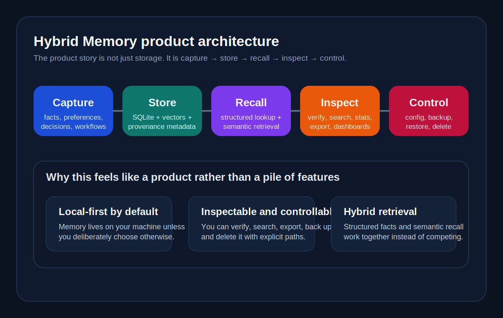
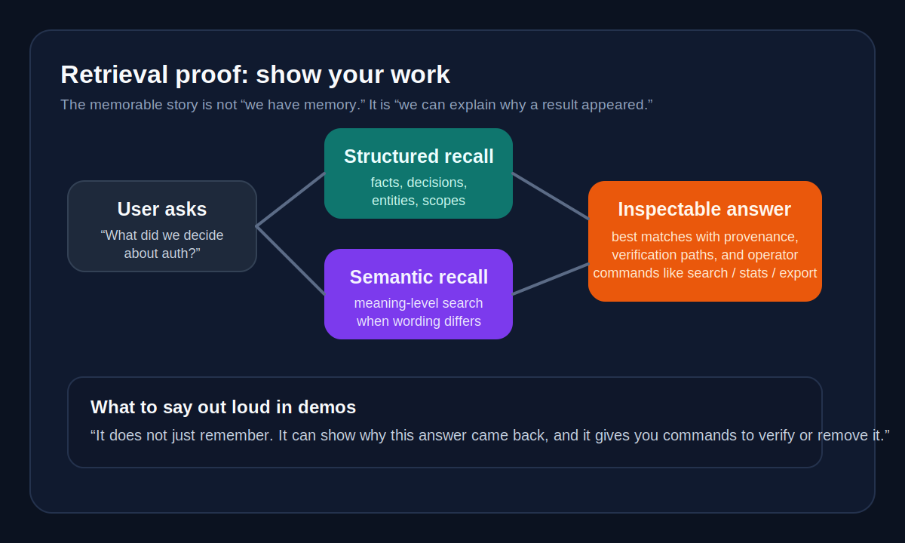
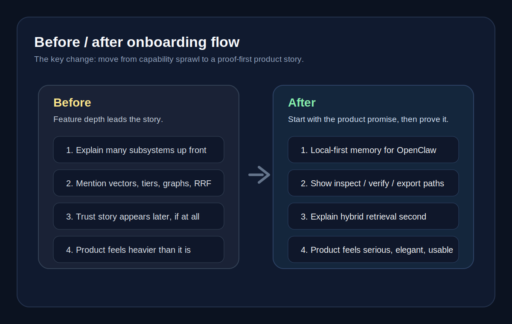

# Presentation strategy

This is the canonical short-form story for how **Hybrid Memory** should be presented in the README, docs site, demos, and future UI copy.

The goal is not to make the product sound simpler than it is. The goal is to make its strength visible faster.

---

## Product message in one sentence

**Hybrid Memory gives OpenClaw durable context that stays local-first, inspectable, and useful over time.**

---

## The 3 things people should remember

1. **Local-first by default**  
   Your memory stays on your machine unless you explicitly choose external providers.

2. **Inspectable and controllable**  
   You can verify, search, export, back up, and delete it. This is memory you can audit, not a black box you hope is behaving.

3. **Hybrid retrieval beats session-only or vector-only memory**  
   Structured facts, semantic search, provenance, and maintenance work together, so recall is stronger and easier to trust.

These three points should show up repeatedly in README, docs home, trust/privacy copy, demos, and any future UI landing surfaces.

---

## Messaging brief

### Tagline

**Local-first memory for OpenClaw that stays inspectable, trustworthy, and useful over time.**

### Elevator pitch

Hybrid Memory turns OpenClaw from a good session assistant into a system that can remember across sessions without becoming opaque or messy. It stores durable context locally by default, merges structured and semantic recall, and gives operators proof paths like verify, search, export, backup, and delete.

### Trust / privacy pitch

Most memory products optimise for convenience first and explainability later. Hybrid Memory starts from operator trust: local-first storage, explicit controls, inspectable recall paths, and documentation that tells you where the data lives and how to remove it.

### Why this exists

Session-only memory makes every serious workflow repetitive. Naive vector memory can retrieve vibes but often struggles with provenance, structure, and control. Hosted memory can be convenient, but it can also feel distant and opaque. Hybrid Memory exists to offer a stronger trade-off: durable memory that still feels serious, inspectable, and under your control.

---

## Comparison messaging

Use these contrasts when positioning the project:

| Compared to… | Say this | Do not imply |
|---|---|---|
| **Session-only memory** | "Useful in the moment, but it starts from zero again." | That session memory is useless — it is just insufficient for long-running work. |
| **Naive vector memory** | "Good at fuzzy recall, weaker at structure, provenance, and operator control." | That vector search is bad — Hybrid Memory includes it, but does not stop there. |
| **Hosted memory** | "Convenient, but often more opaque and less local than serious operators want." | That hosted memory is always wrong — the distinction is trust model and control surface. |
| **Hybrid Memory** | "Local-first, inspectable, and stronger than a single retrieval strategy." | That it is magically correct — the point is proof, control, and better defaults. |

Short comparison line for first-run surfaces:

> **Not just session memory. Not just a vector store. Not a black-box hosted memory service.**

---

## Visual proof package

The product should show proof, not just describe capability.

### Asset list

| Asset | Purpose | Status |
|---|---|---|
| `docs/assets/hybrid-memory-dashboard-mock.svg` | Hero image: shows that the product has an inspectable surface, not only invisible internals | Existing |
| `docs/assets/hybrid-memory-product-architecture.svg` | Product architecture: capture → store → recall → inspect → control | Added in this workstream |
| `docs/assets/hybrid-memory-retrieval-proof.svg` | Retrieval explanation: structured + semantic recall merged into inspectable answers | Added in this workstream |
| `docs/assets/hybrid-memory-onboarding-before-after.svg` | Before/after onboarding flow: from plugin setup to proof-first adoption | Added in this workstream |
| README "What users ask first" table | FAQ-style trust proof on the main landing surface | Existing, now part of the presentation system |

### Hero screenshots / proof points

1. **Dashboard / inspection surface**  
   Show that memory is visible and navigable.
2. **Retrieval proof**  
   Show that recall is not a black box: structured + semantic + provenance.
3. **Trust / control flow**  
   Show verify, backup/export, and delete paths.
4. **Onboarding clarity**  
   Show that first-run setup moves from install to trust quickly.

### Diagrams

#### Product architecture

#### Retrieval proof

#### Before / after onboarding

---

## Demo package

### 60-second demo

**Goal:** make the product feel real in under a minute.

1. State a preference or decision:  
   `Remember that I avoid lunch meetings and Alice owns the API contract.`
2. Start a fresh session / ask a follow-up later:  
   `Find a slot with Alice next week.`
3. Show the answer uses the remembered constraint.
4. Immediately prove it is inspectable:  
   run `openclaw hybrid-mem search "Alice lunch meetings"` or `openclaw hybrid-mem stats`.
5. Close with the line:  
   **"It remembers across sessions, it stays local-first, and you can inspect what it knows."**

### 5-minute operator demo

**Goal:** show this is serious infrastructure, not a memory gimmick.

1. **Install and verify**  
   `openclaw plugins install openclaw-hybrid-memory`  
   `openclaw hybrid-mem install`  
   `openclaw hybrid-mem verify`
2. **Store something durable**  
   Use `memory_store` or natural conversation.
3. **Recall it in a new context**  
   Ask a question that depends on the stored fact.
4. **Inspect and prove**  
   Show `search`, `stats`, or export-related commands.
5. **Show control**  
   Mention backup/export/delete and trust docs.
6. **Close with differentiators**  
   Local-first. Inspectable. Hybrid retrieval.

### "Why local-first memory matters" demo

**Goal:** make privacy and trust concrete without fear-mongering.

1. Show where the data lives locally.
2. Show the commands used to inspect it.
3. Show the commands used to back it up or remove it.
4. Contrast with the hosted-memory trade-off in one sentence:  
   **"Convenience is easy to buy; operator trust is harder. This project optimises for trust first."**

---

## Terminology audit

Use layered language: plain first, exact second.

| Internal / dense term | First-run wording | When to introduce the exact term |
|---|---|---|
| `memory-hybrid plugin` | **Hybrid Memory** | Installation, repo layout, or config specifics |
| SQLite + LanceDB + files | **local memory store** | Architecture / operations docs |
| RRF / merged ranking | **structured + semantic recall** | Retrieval deep dives |
| auto-capture | **remembers important things automatically** | Feature internals |
| memory tiering / compaction | **keeps memory fresh and bounded** | Operations tuning |
| graph retrieval | **follows related facts** | Advanced capability docs |
| procedural memory | **learned workflows** | Advanced capability docs |
| persona proposals | **identity updates the agent can suggest** | Feature-specific docs |
| edicts / verification store | **verified ground truth** | Governance / verification docs |

### Naming guidance

- Prefer **Hybrid Memory** over **memory-hybrid** in user-facing copy.
- Prefer **local-first** over **on-device** unless hardware locality is the point.
- Prefer **inspectable** and **verifiable** over vague words like **transparent** unless proof paths are shown nearby.
- Prefer **show its work** for demos; prefer **provenance / verify** for operator docs.

---

## Copy system: what to repeat

### Approved phrases

- **local-first by default**
- **inspectable and controllable**
- **show your work**
- **durable context**
- **structured + semantic recall**
- **trustworthy over time**
- **serious operator workflow**

### Avoid as first-contact copy

- "hierarchical hybrid memory substrate"
- "FTS5 + LanceDB fusion"
- "RRF-based retrieval"
- "dynamic derived data"
- "memory slot plugin"

Those terms belong in deep docs, not in the first paragraph.

---

## Surface guidance

| Surface | Primary message | Supporting proof |
|---|---|---|
| **README hero** | Local-first, inspectable, useful over time | Hero image + FAQ table + comparison matrix |
| **Docs home** | Persistent memory that stays under your control | Before/after table + repeated differentiators |
| **Trust & privacy page** | Trust is a feature, not a footnote | Local storage, verify, backup, export, delete |
| **Scenarios page** | Less repetition, better continuity, more confidence | Concrete before/after situations |
| **Future UI landing surfaces** | Show what the system knows and how to inspect it | Search, provenance, stats, export, delete |

---

## Acceptance check

This workstream is successful when:

- the one-sentence message is obvious
- the three differentiators are repeated consistently
- demo stories prove trust instead of merely claiming it
- terminology gets simpler for first-time readers without losing precision later
